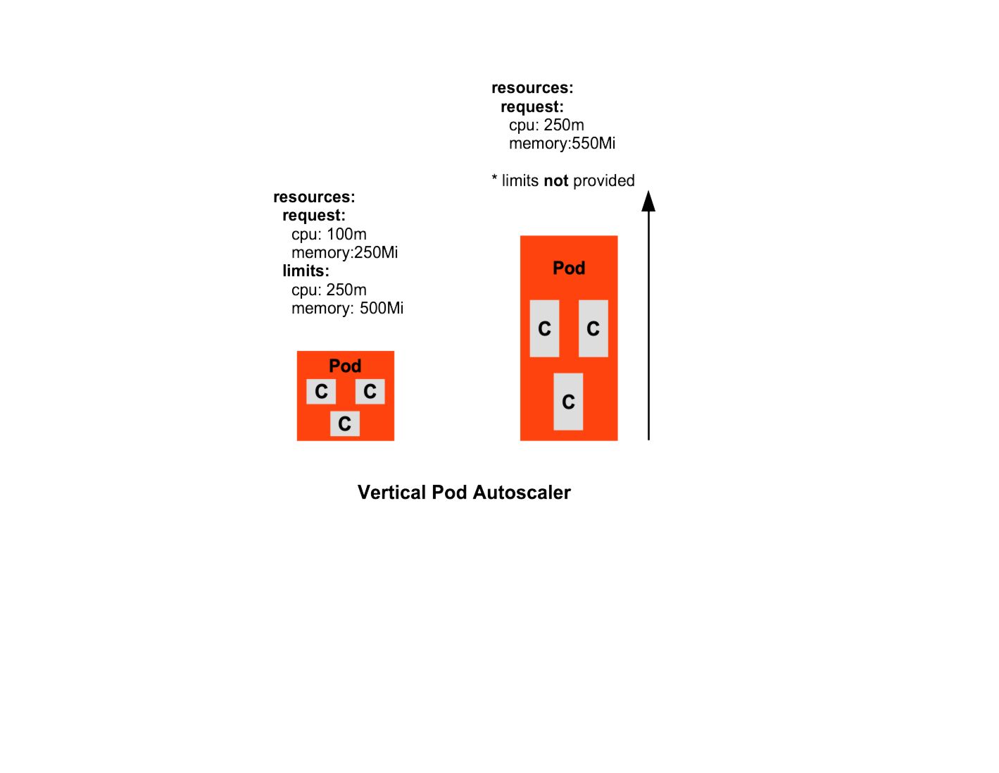
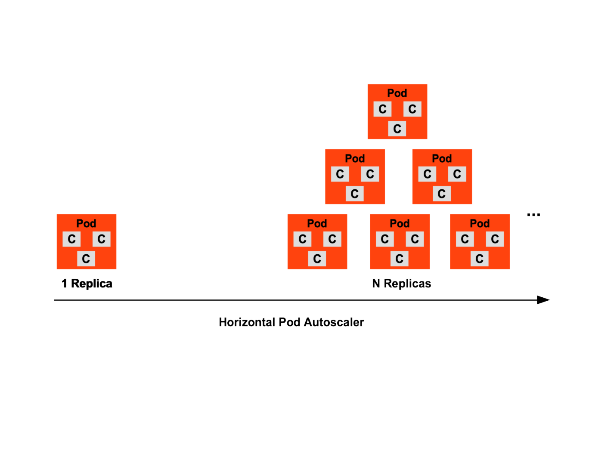

# K8s Auto-Configuring Correct Pod Container CPU, CPU Cache and Memory Requests and Thresholds
Standard K8s Container-Native Planning Standard Template for Right-Sizing Containers for Kubernetes Clusters. 


## Right-Sizing Workload Containers

To reserve the correct configuration sizing of K8s resources, a required step is to analyze the current resource usage of the containers. For that there are two procedures, the first is through the use of PromQL Query that calculates the average CPU utilisation for all the containers associated with its workload. Understanding a workload as a `Deployment`, a `StatefulSet`, or a `DaemonSet`. The second procedure is for K8s developers to provide a `Vertical Pod Autoscaler` (VPA) as part of the application Helm Chart as a **vpa.yaml** file and during traffic load testing of the app, to turn on the VPA in its correct profiler configuration and have the VPA collect and provision the correct `target` request values to supply to the Pod's `resources.request.cpu` and `resources.request.memory` configurations. The section that follows `Autoscaling in K8s using VPA and VPA Operation Strategies` provides developers how this works into their K8s applications. These two steps, in-particular the second step are 100% required for ALL app teams provisioning their services to K8s. 


## Autoscaling in K8s using VPA and VPA Operation Strategies

### Pre-requisites on the K8s Cluster

- The K8s Cluster (any of standard K8s clusters GKE, AKS, ...) requires metrics-server installed and active.
The metrics-server will collect K8s resource use statistics (cpu, memory, user-defined metrics) to give the Vertical Pod Autoscaler (VPA) the info it requires to actively escalate your K8s resources to vertically scale. 


### Installing the VPA

The following Helm Chart Repository refers to the VPA Helm Operator. 

See `https://artifacthub.io/packages/helm/fairwinds-stable/vpa`

The VPA from `Fairwinds` will work across **ANY** Kubernetes cluster. The only prerequisite is the `metrics-server` on the Kubernetes Nodes and to qualify this using a `kubectl top pods` or `kubectl top nodes` at the shell.

The VPA Helm Operator can get installed in several ways.

- Install at the point the K8s Cluster is provisioned using `Terraform` and the `Terraform Helm Provider` using a resource `helm_release` as a Terraform child module. This `helm_release` Terraform module needs to use a Terraform 1.5 module `depends_on = []` to guarantee the Kubernetes Cluster context exists first.

- Install at the point AFTER the K8s Cluster is provisioned using `Terraform` and the `Terraform Helm Provider` using a resource `helm_release` as a Terraform child module. The difference in this way, is that the Terraform child module for the VPA is an "add-on" among a range of Kubernetes add-ons. The Terraform child modules are added-on or "cherry-picked" into the Kubernetes Clusters on-demand and not pre-loaded as in approach #1. This child module for VPA using the add-on pattern is triggered as a secondary stage using a CI/CD pipeline or a flag to turn on and triggered as a GitOps push to Git and a Terraform FluxCD Controller issuing the Terraform `plan` and `apply` workflows.

- Install at the point the K8s Cluster is provisioned or at the point AFTER the K8s Cluster is provisioned using a GitOps for FluxCD or for ArgoCD pattern. For ArgoCD an `Application` CR is added to the `App of Apps` Git repository folder structure or using ArgoCD `ApplicationSet` with the Helm Repository URL of the VPA, `https://artifacthub.io/packages/helm/fairwinds-stable/vpa`, referenced, any changes upstream at this repository are automatically applied and reconciled to the K8s Clusters referencing this Helm Chart. 


```shell
helm repo add fairwinds-stable https://charts.fairwinds.com/stable
helm install vpa fairwinds-stable/vpa --namespace vpa --create-namespace

```


### Understanding the Pod QoS Offerings


There are three Pod Quality of Service (QoS) offerings that are detected at the VPA. Each quality of service level is elevated as the Pod defines the values from `None` or defined as `resources: {}` to any higher quality level with the following definitions.

- Pod QoS "Best Effort"
- Pod QoS "Burstable"
- Pod QoS "Guaranteed"


Pod QoS without defining any values is "Best Effort". This QoS does not offer guarantee of scheduling and if it does it priority for scheduling is lowered. The Pod does not define any resources per-container and if scheduled to a Node will not have a ceiling to cap its consumption for `cpu` and `memory` at the request level and for its limits. This Pod can consume as much of these two resources as the Node OS offers and is a high risk for eviction in addition to force evictions of Pod that specify full request and limit levels for their cpu and memory resources. 

The following is a red-flag and can automatically be rejected in the admission control chain when a deployment having this configuration is encountered at the `kubernetes api server`. K8s admission controllers that can automatically reject this configuration such as `Kyverno`, could audit the deployment and include in-stream alteration of the `Pod.container.spec` per-container image and apply pre-calculated values prior to re-assessing and allowing admission of the deployment.


```Yaml
  ...
  resources: {}

```

The following QoS with the request level resources for `cpu` and `memory`, however **NOT** for limit levels offers "Burstable" class. The request levels are configured for the two resources, however there is no ceiling cap defined for the limits. The K8s `Scheduler` will elevate the priority for Node scheduling ahead of the lowest class "Best Effort" Pods, however queue behind the higher-class "Guaranteed" Qos Pods. The lack of limits configured for this Pod translates to Pods high-risk of spiked resource consumptions beyond its request levels and consuming to the limits of the Node OS resources. This places high risk of preventative scheduling of other Pods that are in the scheduling queue with fully defined "Guaranteed" QoS configurations. 


```Yaml
  ...
  resources:
    request:
      cpu: <value>
      memory: <value>
    limits:
      cpu: ""
      memory: "" 
```

The last Pod QoS config is the following showing "Guaranteed" QoS.

```Yaml
  ...
  resources:
    request:
      cpu: <value>
      memory: <value>
    limits:
      cpu: <value == 2x of request cpu config> 
      memory: <value == 2x of request memory config>
```

### VPA and HPA (Horizontal Pod Autoscaler) 

- The VPA DaemonSet profiles targeted K8s Deployments and vertically scales (cpu, memory, user-defined metrics) on predicated conditions (percentage threshold for cpu, memory or user-defined metrics) defined in the VPA for the Deployment (Pods). The VPA appropriates the correct resource configurations for the container spec in Pods. If the VPA UpdatePolicy is configured as Off, the VPA profiles the targeted Deployments and auto-calculates  the correct resource values (cpu,  memory) and K8s administrators can correctly configure or re-configure these resources in the container spec of the Pod to avoid future Pod eviction conditions during deployments. The VPA with the UpdatePolicy configuration as Off does NOT update and rollout new Pods if the VPA calculates the Pods existing configs are not sufficient. To configure the VPA to auto-configure and re-rollout the Deployments (deploy new Pods and drop the old Pods), the UpdatePolicy is configured as Auto. The auto-scaling for VPA saves costs as the receding of the vertically scaled-up Pod resources ensures the Pods are not over-provisioned. 



- The HPA DaemonSet profiles targeted K8s Deployments and horizontally scales Pods  on predicated conditions (percentage threshold for cpu, memory or user-defined metrics) defined in the HPA for the Deployment (Pods). The HPA appropriates the correct Pod allocation using a low-threshold  and high-threshold range and deploys the new Pods up to the high-threshold replica count and only reverts the replica-count once the percentage threshold recedes. The auto-scaling for HPA saves costs as the receding of the horizontally scaled-out Pods ensures the cluster nodes are not over-provisioned with unused Pods.




- The VPA and HPA cannot execute as side-car scaling solutions (if VPA calculates it requires to scale up  the Pods resources while the HPA calculates it requires, in-parallel, to scale out the Pods) using the default cpu or memory predicate conditions. The ONLY approach to allow edge-case side-car auto-scaling with the VPA and HPA is to VPA and HPA target user-defined metrics. The Deployment requires a definition of a user-define metric for the VPA and HPA to work collectively as a side-car.

### VPA vs HPA Side-Car Execution Rules 

The VPA is usually executed along with an app deployment to K8s during `non-prod`, `uat`, `test` and `preprod` app environment load testing. The process at the start is executed without the inclusion of it integrated in a CI pipeline (GitHub Actions workflow action, Azure DevOps pipeline task) until the K8s devs understand its process and integrate this into a CI workflow. The VPA is usually run on its own. It is not run alongside a side-car autoscaler such as the HPA. If the app is require to run the HPA, then during the load testing stages, the HPA should get turned off just to silo the resource calculation provided through the VPA. After a series of VPA tests against the app, then the K8s resources (a Helm Chart) can return to turning on the HPA. The conflict with VPA and HPA is that the two in-parallel cannot acquire the Pods resources for `cpu` and `memory`. The kernel will not offer this as an option so after and only AFTER the VPA is run, can the HPA run. Again if they are keying their scaling on cpu and memory, the sidecar running of VPA and HPA cannot occur. There is an exception.

The exception to the rule for running the VPA and HPA in parallel is if and only if the HPA is tasked to scale on a metric for the app that is NOT `cpu` or `memory`. One the VPA or HPA can acquire this particular metric. The soliution if the edge case qualifies to run these two in parallel is if the HPA is targeting an app-specific metric such as a `guage` , `counter` or `histogram` metric where this is specified as annotation in the app code using a client API offered through `Prometheus` metrics API. The other specific metric could key on pending API service requests in a queue in K8s such as NATS or Azure Event Service. This involves a scale-to-zero auto-scaler that works with the HPA as KEDA does. KEDA is the Kubernetes Event Driven Autoscaler. This is NOT covered here.

### VPA and VPA Operation Strategies

The VPA automatically adjusts the cpu and memory configurations for the Pods. The VPA will automatically recreate the Pod(s) with the appropriate cpu and memory configurations. This course of action the VPA takes will free up the cpu and memory for the other Pods and assist in efficiency gains for the K8s Cluster.

To qualify the VPA can operate correctly, the existing K8s Cluster requires the activity of the metrics-server. To qualify the metrics-server on the K8s Cluster, execute the following:

```
kubectl top pods  -n <namespace>
```
If the executed line does NOT render any status on cpu and memory use, then the metrics-server is not installed and active.
The cloud managed K8s Clusters (Azure AKS, GCP GKE) intrinsically have the metrics-server active as a default. The metrics-server is required to work with the VPA. The VPA is installed into the K8s Cluster using native K8s YAML (using `kubectl apply -f <vpa-*>.yaml`), K8s Helm (using `helm install <helm-release> <helm-chart-directory>` or using kustomize. The VPA definition will specify a target to scale (a Deployment, StatefulSet) and refer to the name of this K8s target. In this case here is a K8s Helm Chart template file for a VPA:

Source: <git-repo>   - This repo will copied for reference to OD Git repo
```Yaml
{{- if .Values.vpaAutoscaling.enabled }}
apiVersion: autoscaling.k8s.io/v1
kind: VerticalPodAutoscaler
metadata:
  name: app-vpa
  namespace: {{ .Values.namespace.name }}
  labels:
    {{- include "app-tenant.labels" . | nindent 4 }}
spec:
  targetRef: 
    apiVersion: "apps/v1"
    kind: Deployment
    name: app
  updatePolicy:
    updateMode: {{ .Values.vpaAutoscaling.updatePolicy.updateMode | squote }}
  resourcePolicy:
    {{- with .Values.vpaAutoscaling.resourcePolicy -}}
        {{- toYaml . | nindent 4 }}
    {{- end }}
      controlledResources: ["cpu", "memory"]
{{- end }}
```

The corresponding `values.yaml` or in actual environments to deploy to the files would have a `value-{env}.yaml` where `{env}` is a range of.

- values-{non-prod}.yaml
- values-{uat}.yaml
- values-{test}.yaml
- values-{preprod}.yaml
- values-{prod}.yaml

and the `default` or globally values across all these environments using the provided `values.yaml`. This repo for the discussion of the vpa will collect its values using the default `values.yaml` file.

The following **default** `values.yaml`  files to provide the actual values for the `vpa` template in the file `app-resources.yaml` is as follows:

```yaml
vpaAutoscaling:
  enabled: true    --------------(1)
  updatePolicy:
    updateMode: "Off"   ---------(2)
  resourcePolicy:
    containerPolicies:
    - containerName: '*'
      controlledValues: RequestsAndLimits
```

The previous provided values in the `values.yaml` show two of the highest key points to understand with the configuration of the
VPA and these are.

**(1)** The conditional value to turn on the VPA during `nonprod`, 'uat`, `testing` and `preprod` as true will allow the VPA
to deploy along with K8s app resources. If this value is `false` as it should for `prod` then the VPA does not get deployed to
the cluster.

**(2)** The `updatePolicy.updateMode` is configured with `Off` and this deploys the VPA as a profiler only and will NOT update the `Deployment.Pod.Containers.Resources` spec. This "Off" configuration only serves as an advisor and provides a matrices file to `stdout` showing its advised configuration for `cpu` and `memory` requests. The VPA in this configuration or in any of its alternate configurations (updatePolicy.updateMode: "Auto", updatePolicy: "Create") 

As soon as the rendering of the Helm template for the VPA definition in the `app-resources.yaml` is done using the provided
`values.yaml` the following YAML is provided.

```yaml
# Source: k8s-vpa-helm/templates/vpa.yaml
apiVersion: autoscaling.k8s.io/v1
kind: VerticalPodAutoscaler
metadata:
  name: k8s-odpapp-deployment-vpa --------> ${parameterize}
  namespace: plugin-odp-namespace --------> ${parameterize}
  labels:
    app: k8s-app-deployment       --------> ${only if using labels}
    ...
spec:
  targetRef:
    apiVersion: "apps/v1"
    kind: Deployment
    name: k8s-app-deployment.     ---------> ${parameterize}
  updatePolicy:
    updateMode: Off
  resourcePolicy:
    containerPolicies:
    - containerName: '*'
       maxAllowed:
        cpu: 1         ------> ${parameterize cap recommendation}
        memory: 500Mi  ------> ${parameterize cap recommendation}
      minAllowed:
        cpu: 0m.       ------> ${parameterize cap min recommendation}
        memory: 0Mi    ------> ${parameterize cap min recommendation}
      controlledValues: RequestsAndLimits
      controlledResources: ["cpu", "memory"]
```

The previous K8s VPA manifest is detailed as follows.

**Lines 5 thru 6** The VPA name will take the name of the `Deployment.metadata.name` plus the suffix `-vpa` allowing intuitive search for this on the running  namespace in the cluster.

**Lines 10 thru 13** The VPA will target a specific Deployment using its name. The VPA cannot profile different Deployments as the association is strictly `1:1`. One VPA per-Deployment. If and ONLY if the OD app uses > 1 Deployments (as a case 3 Deployments), then its is required to deploy 3 VPAs each targeting that Deployment it is assigned to. There isn’t such a thing allowed for VPAs to have a `1:M` association. **Line 13** is a templated field value and will require parameterization to point to a distinct Deployment per its name.


**Lines 14 thru 20** No parameterization is required. These lines will always stay static across all VPA deployments. Line 15 configures the VPA to run it one of its 4 modes, which in this case using the value pair updatePolicy: Off, is Recommender mode. This mode does NOT alter the configuration of the targeted Deployment. This mode puts the VPA in a profiler/observer mode and collects internal metrics once the Deploymentin K8s is receiving traffic load against its API endpoint. The VPA WILL NOT work if no web traffic is issued against the app’s API endpoint. This web traffic generation is 100% the responsibility of the app developer, NOT the KubeOps SREs. Line 18 tells the VPA that if the Pod contains 1 or >1 containers it will account for those extra containers during its profiling. This * acts as glob operator and accounts for all containers current or added in the future, such as adding in the future a side-car container for Service Mesh or init-containers required to do pre-loading of services for the primary application container.


The following variant of the previously defined VPA resource is provided incase of v1 not recognized in K8s cluster where we removed the resourcePolicy key.


And as the `targetRef` shows, this targets the Deployment to scale up the resources. The Deployment definition for full view is here:

```yaml
apiVersion: apps/v1
kind: Deployment
metadata:
  name: {{ include "k8s-app-deployment.fullname" . }}
  namespace: {{ .Values.namespace.name }}
  labels:
    {{- include "k8s-app-deployment.labels" . | nindent 4 }}
spec:
{{- if not .Values.hpaAutoscaling.enabled }}
  replicas: {{ .Values.replicaCount }}
{{- end }}
  selector:
    matchLabels:
      {{- include "k8s-app-deployment.selectorLabels" . | nindent 6 }}
  template:
    metadata:
    {{- with .Values.podAnnotations }}
      annotations:
        {{- toYaml . | nindent 8 }}
    {{- end }}
      labels:
        {{- include "k8s-app-deployment.selectorLabels" . | nindent 8 }}
    spec:
      {{- with .Values.imagePullSecrets }}
      imagePullSecrets:
        {{- toYaml . | nindent 8 }}
      {{- end }}
      serviceAccountName: {{ include "k8s-app-deployment.serviceAccountName" . }}
      securityContext:
        {{- toYaml .Values.podSecurityContext | nindent 8 }}
      containers:
        - name: {{ .Chart.Name }}
          securityContext:
            {{- toYaml .Values.securityContext | nindent 12 }}
          image: "{{ .Values.image.repository }}:{{ .Values.image.tag | default .Chart.AppVersion }}"
          imagePullPolicy: {{ .Values.image.pullPolicy }}
          ports:
            {{ .Values.ports | toYaml | indent 12 | trim }}
          livenessProbe:
            {{ .Values.livenessProbe | toYaml | indent 12 | trim }}
          readinessProbe:
            {{ .Values.readinessProbe | toYaml | indent 12 | trim }}
          resources:
            {{- toYaml .Values.resources | nindent 12 }}
      {{- with .Values.nodeSelector }}
      nodeSelector:
        {{- toYaml . | nindent 8 }}
      {{- end }}
      {{- with .Values.affinity }}
      affinity:
        {{- toYaml . | nindent 8 }}
      {{- end }}
      {{- with .Values.tolerations }}
      tolerations:
        {{- toYaml . | nindent 8 }}
      {{- end }}

```

As the previous `Deployment` resources is rendered with its provided `values.yaml` (see the provided `k8s` directory for app-service.yaml) and the following is shown:

```yaml
apiVersion: apps/v1
kind: Deployment
metadata:
  name: k8s-app-deployment
  namespace: k8s-app
  labels:
    helm.sh/chart: k8s-app-deployment-0.1.0
    app.kubernetes.io/name: k8s-app-deployment
    app.kubernetes.io/instance: k8s-app
    app.kubernetes.io/version: "1.16.0"
    app.kubernetes.io/managed-by: Helm
spec:
  selector:
    matchLabels:
      app.kubernetes.io/name: k8s-app-deployment
      app.kubernetes.io/instance: k8s-app
  template:
    metadata:
      labels:
        app.kubernetes.io/name: k8s-app-deployment
        app.kubernetes.io/instance: k8s-app
    spec:
      serviceAccountName: k8s-app-deployment
      securityContext:
        {...}
      containers:
        - name: k8s-go-app
          securityContext:
            {...}
          image: "odp-apps/k8s-app:1.0"
          imagePullPolicy: Always
          ports:
            - containerPort: 8080
              name: http
              protocol: TCP
          livenessProbe:
            httpGet:
              path: /health-check
              port: 8081
              scheme: HTTP
            initialDelaySeconds: 10
            periodSeconds: 5
          readinessProbe:
            httpGet:
              path: /health-check
              port: 8081
              scheme: HTTP
            initialDelaySeconds: 5
            periodSeconds: 3
          resources:
            limits:
              cpu: 200m
              memory: 250Mi
            requests:
              cpu: 100m
              memory: 125Mi
```

## Traffic Loading K8s App, Triggering the VPA

- Prerequisites: https://github.com/ddosify/ddosify/tree/master/engine_docs

`ddosify`is a traffic generator for application endpoints. The VPA will `NOT` provide any target 
recommendations if the application active in K8s is idle. The VPA requires that is `targetRef` Deployment receive traffic in which the VPA profiler than spike and calculate the metrics for final recommendation. 

To see the VPA running in the K8s Cluster, the K8s administrator can issue a : `kubectl get vpa` and the shell will show the actively running VPA. The VPA will profile the running (targeted) Pods (through the deployed Deployment) and after 5-10 minutes of instrumentation, the K8s administrator can issue a `kubectl describe vpa <vpa-name>` and the critical status to inspect will show:

```
Spec:
 	Target  Ref: 
  	API Version: apps/v1
	  Kind: Deployment
	  Name: k8s-app  -------------(1)
	  UpdatePolicy:
	     Update Mode: Off       ------------ (2) 
	Status:

Recommendations:

    Container  Recommendations:
      Container Name: k8s-app-<container>
      Lower Bound: 
        cpu:  100m
        memory: 270150k
      Target:            --------------(3)
        cpu: 125m
        memory: 30000k
      Uncapped:
        cpu: 200mm
        memory: 370050
      Upper Bound: 
        cpu: 6000m
        memory: 6502500k

```

Analysis of the previous output and collection of the auto-calculated `Target` to apply to the `Deployment.Pod.Container.Resources` spec. 

**(1)** The `Deployment` the VPA is targeting as per the VPA configuration during the profiling process.

**(2)** If VPA `updatePolicy.updateMode` is configured with `Off` it just advises, If the VPA is configured with `Auto` or `Create`,  VPA recreates Pods with changed specs if the Pod containers are leveraging less than their requested resources. This side-effect will cause interval disruption.

**(3)** The yield with the VPA is the `Target`. This is the value after a series of consecutive profile tests and collecting an average will this target value apply to the app Pod resources settings. This is the value that will get copied and applied to the Pod resources for cpu and memory. The VPA will NOT provide advisory target settings for limits. It only provides for request-level resources. 


## VPA for Requests and Limits

If you choose the **RequestsAndLimits** option, then requests are computed based on actual usage. The **limits are calculated keyed on the current Pod request and limit ratio**. As a use case, if you start with the Pod that requests 1 CPU and limits to 2 CPUs. VPA will always set the limit to be twice as much as requests. The same principle applies to memory. So in the **RequestsAndLimits** mode, **treat your initial application resource requests and limits as a template.**


## VPA References
https://povilasv.me/vertical-pod-autoscaling-the-definitive-guide/

### VPA Load Testing (Video on Ddosify)
https://www.youtube.com/watch?v=AhZ3YStdaQs&t=23s

